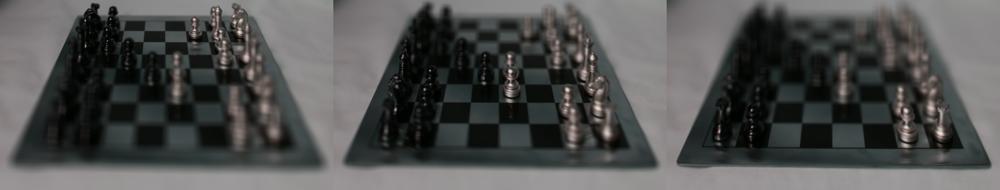
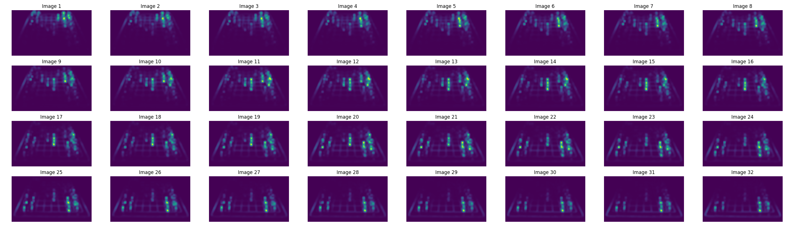
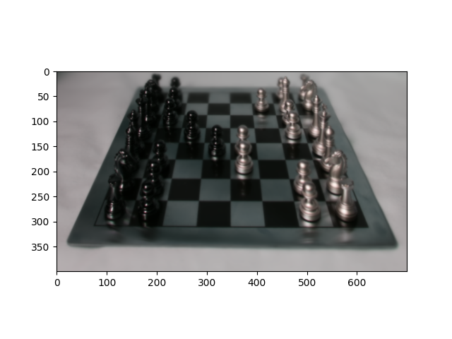
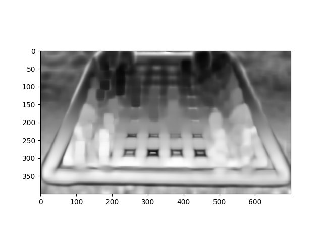

# Computational Photography - Programming Exercise 2

## Description
This assignment explores lightfields and focal stacks, combining them into a single pipeline. You'll synthesize a focal stack from a lightfield image captured with a plenoptic camera and then compute an all-in-focus image and a depth map from the synthetic focal stack.

## Files
- **all_focus.py**: Python function for generating an all-in-focus image and a depth map from a focal stack.
- **lightfield_converter.py**: Python function for loading the plenoptic image and arranging it into a lightfield.
- **main.py**: Script to run all subsections.
- **read_mat.py**: Python script for reading MATLAB files.
- **refocus.py**: Python function for refocusing and generating focal stacks.

- **ex2_q2_mj.png**: Refocused images with different aperture masks.
- **all_focus_image.png**: All-in-focus image.
- **depth_map.png**: Corresponding depth map.

## output
### Wights

### All_Focus

### Depth

## Instructions
1. Run **Mmain.py** to execute all subsections.
2. download the **chessboard_lightfield.png**, it to big for github
3. Ensure all required dependencies are installed.
4. Refer to the provided hints and information for efficient implementation.
  
## Dependencies
- numpy
- scipy
- matplotlib
- OpenCV (cv2)

## References
- [The (new) Stanford Light Field Archive](http://lightfield.stanford.edu/)
- Ng, R., Levoy, M., Bredif, M., Duval, G., Horowitz, M., & Hanrahan, P. (2005). Light field photography with a hand-held plenoptic camera. Stanford Computer Science Technical Report.
